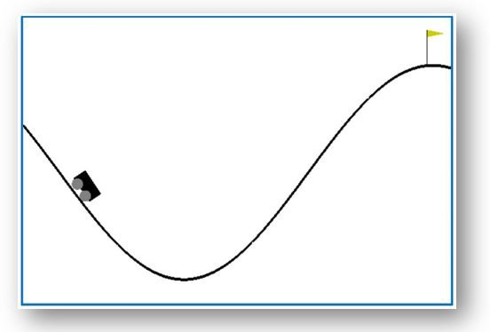

# Reinforcement_learning_apps

In this Project i will try to solve some gym environements with reinforcement learning algorithms:
- Qlearning (table version)
- Deep Qlearning (Q_network)
- Deep Qlearning (Q_network & Q_target)
- Monte Carlot Tree Search 
- REINFORCE (Policy gradient)
- Advantage actor critic
- CrossEntropy & Deep CrossEntropy
- Value iteration in a Markov Decision Process

### Gym Environements:

#### Mountain Car Problem:



A car is on a one-dimensional track, positioned between two "mountains". The goal is to drive up the mountain on the right; however, the car's engine is not strong enough to scale the mountain in a single pass. Therefore, the only way to succeed is to drive back and forth to build up momentum.[OpenAI](https://gym.openai.com/envs/MountainCar-v0/)

The goal then is to train an agent with reinforcement learning to solve this task.

#### CartPol Problem:


A pole is attached by an un-actuated joint to a cart, which moves along a frictionless track. The system is controlled by applying a force of +1 or -1 to the cart. The pendulum starts upright, and the goal is to prevent it from falling over. A reward of +1 is provided for every timestep that the pole remains upright. The episode ends when the pole is more than 15 degrees from vertical, or the cart moves more than 2.4 units from the center.


##### install dependencies:

```
$ pip install -r requirements.txt
```

#### Qlearnig:

##### Train and save the agent:

```
$ cd ./QLearning
$ python3 Q_learning.py
```

##### load the agent and make decision for a given state:

```
$ python3 test_Qtable.py
```

#### Deep Qlearning (Q_neatwork):

##### Train and save the agent:

```
$ cd ./DQN
$ python3 main.py
```

#### Monte Carlo Tree Search:
```
$ cd ./MonteCarloTreeSearch
$ python3 MCTS.py
```

#### REINFORCE (Policy Gradient):
```
$ cd ./REINFORCE
$ python3 main.py
```

